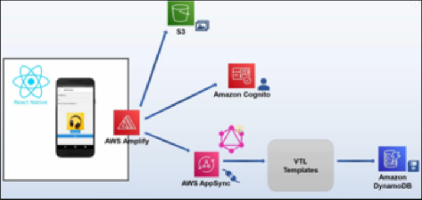

# Architecture Diagrams
### Development Environment
The architecture used is based off of AWS Amplify. React Native is the JavaScript library used to develop for both Android and iOS devices, AWS S3 provides a storage solution, AWS Cognito provides authentication for the app, and AWS AppSync creates a GraphQL endpoint to interact with AWS DynamoDB as the backend database.

</img>

### Database Design
With the use of DynamoDB we created three tables to hold our data, with relationships shown between each table. One-to-One relationship between an Item and a Pantry and a one-to-one relationship between a ShoppingList and a Pantry. We used GraphQL in order to manipulate or extract data from our database. With the above relations, we were able to easily relate any individual entry in the database itself. Our intent with the design was to allow us to clearly relate Items to Pantrys, and ShoppingLists to Pantrys and thus Items. It made sense to have everything related to a Pantry as that acted as the central repository for all Items that were added by a User.  

</img>

### Hardware Diagrams
The circuit connects the Scale (shown by the small circuit to the left) with the Arduino Mega 2560, which sends data to the ESP32 DEVKIT V1 to send to the database through Wi-Fi. The Scale connects to the Arduino’s 3.3 V, the D2 pin, the D4 pin, and GND. The ESP32’connects to the Arduino through the ESP32’s RX2 and TX2 pins, which connect to the board’s RX0 and TX0 pins, respectively. The ESP32 also connects to the Arduino’s GND. 

</img>

### Note About Final System Design Documentation
This documentation includes information about all functions in the project. This information can be found using the **Reference** and **Source** tabs at the top left of this web page. The functions in each file are listed out, and the full source code can be found as well.

**NOTE**: Several features used throughout the project were imported from various creators and changed for use in the app. Imported features include:
- Notifications, which are done through Expo
- The navigation drawer, which is imported from React
- The mutations.json and queries.json files used for accessing/mutating the database were autogenerated via Amplify from AppSync (AWS)
- Barcode scanning features were imported from React
- Recognizing barcodes was done using the Edamam API
- The database is stored on AWS DynamoDB
- Verifying credentials is done using AWS Cognito
- Development of the app was done using the Expo Go app

The code for App.js and the JavaScript files in the screens folder was all coded by our group, although most of them include a few elements imported from React and React Native for support of app development, such as buttons, inputs, Screen stacks, etc. For full information, view the code as mentioned at the begining of this section. Imports for each file are stored at the top, and most of the imports come from React, Expo, and AWS Amplify.