# User Interface
### Sign In Page
This is the page the user will be sent to when they first open the app. If they have previously created an account, they may enter their username and password in the appropriate input fields, and click the **SIGN IN** button to log in to their account. If a user has created an account but cannot remember their password, they may click the **Forgot Password** button to be navigated to a new screen to reset their password. If the user has not yet created an account, they may select the **Sign Up** button to be navigated to another new screen which will allow them to create a new account.

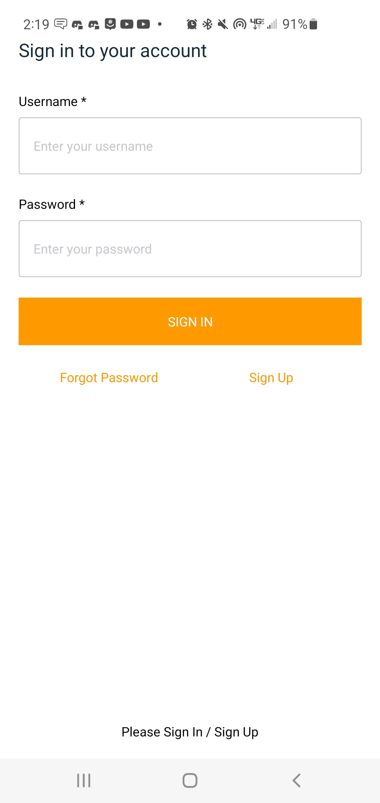</img>

### Create Account Page
This is the page the user is sent to if they select the **Sign Up** option from the **Sign In Page**. They will be able to enter a new username, password, email address, and phone number in the appropriate fields. When all 4 fields have been filled in by the user, they may select the **SIGN UP** button to navigate to a screen which will allow them to confirm their email address. The user may alternatively select the **Confirm a Code** option to be directed automatically to the same screen as the **SIGN UP** button, however it will not send a code upon being clicked. The user may also return to the **Sign In Page** by selecting the **Sign In** button in the bottom right corner.

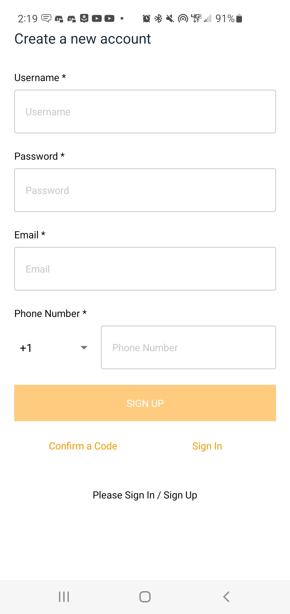</img>

### Confirm Email Page
This is the page where a user may confirm their email address by entering a special code which was sent to their email. To confirm the code, they must enter their username and their received confirmation code in the appropriate input fields. The user may then select **Confirm** to confirm their information and be redirecting to the **Sign In Page**. The user may also choose to have the code resent by clicking **Resend Code**, or to navigate back to sign in without creating a new account by selecting **Back to Sign In**.

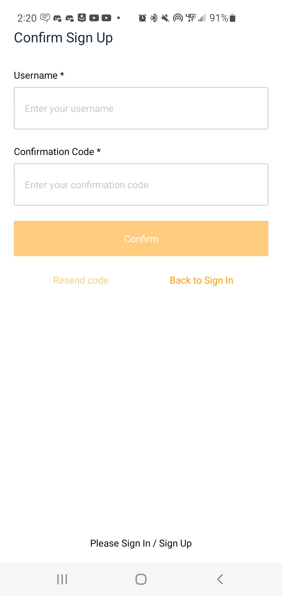</img>

### Landing Page
This is what the user will see when they first sign in to their account. To navigate to different parts of the app, the user may select the menu in the top left corner of the page. This will bring up a drawer with options for navigation.

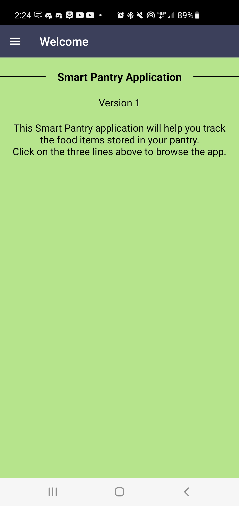</img>

### Navigation Drawer
The drawer includes links to some of the different pages on the app. The user may choose to navigate to the landing page at any time by selecting the **Welcome** option. The user may also choose to view their pantry by selecting the **My Pantry** option. The user can view their shopping list by selecting the **Shopping List** option. The user will be navigated to their profile screen using the **My Profile** option. The help screen can be visited by clicking the **Help** option. The settings menu can be accessed by selecting the **Settings** menu. Finally, the user may choose to sign out of their account by selecting the **Sign Out** option.

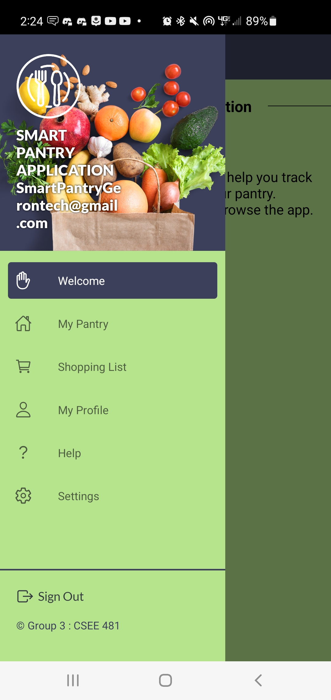</img>

### Create Pantry Page
This screen is shown to the user before they have created a pantry. It is a button labeled **Create Pantry** which the user may click to be navigated to the **Name Pantry Page**.

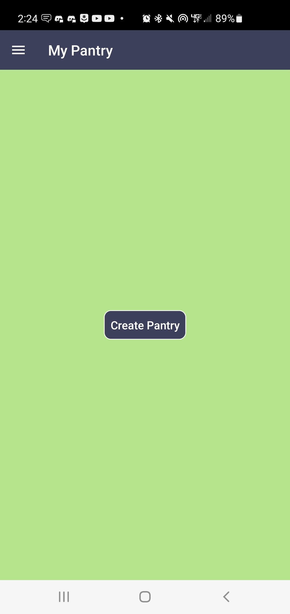</img>

### Name Pantry Page
This page allows the user to enter a name for their pantry in an input field, and then select the **Submit** button to navigate to the **View Pantry Page**.

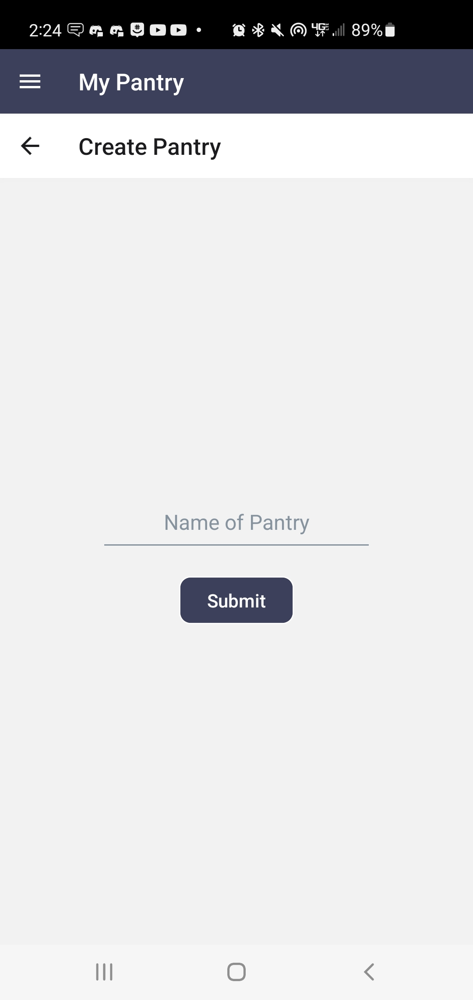</img>

### View Pantry Page
The first time the user navigates to this page, it will look like the below image. The user will see the name of their pantry displayed, and they will have the option to add an item to their pantry by selecting **Add Item**. This will navigate the user to the **Add Item Page**.

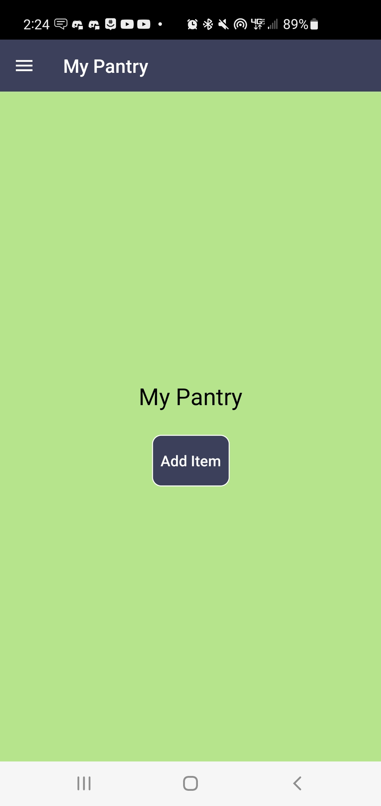</img>

After adding items to the pantry, each item will be displayed on this page with their name, as well as their weight, quantity, and/or expiration date if the user filled in any of those optional fields. The user will also have the option to update an item with the **update** button, or delete it from their pantry using the **delete** option.

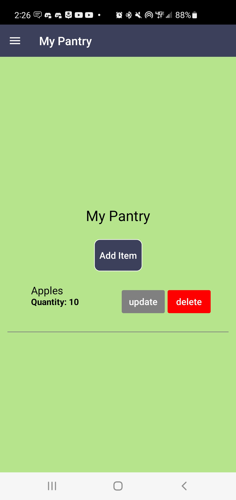</img>

### Add Item Page
On this page, the user will have the option to add an item to their pantry by specifying a name and optionally a weight, quantity, and/or expiration date in their respective fields. The user may also choose to navigate to the **Barcode Add Page** by selecting the **Barcode Add** button, or they may choose to add their input information to their pantry using the **Submit** button.

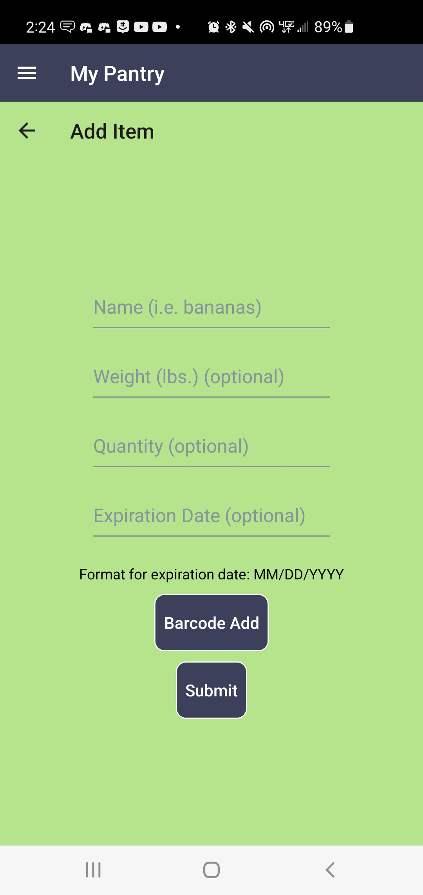</img>

### Barcode Add Page
On this page, the user's camera is opened up, and the user may scan the barcode of a food item they have. The information from the barcode scan will be used to create a new item in the user's pantry.

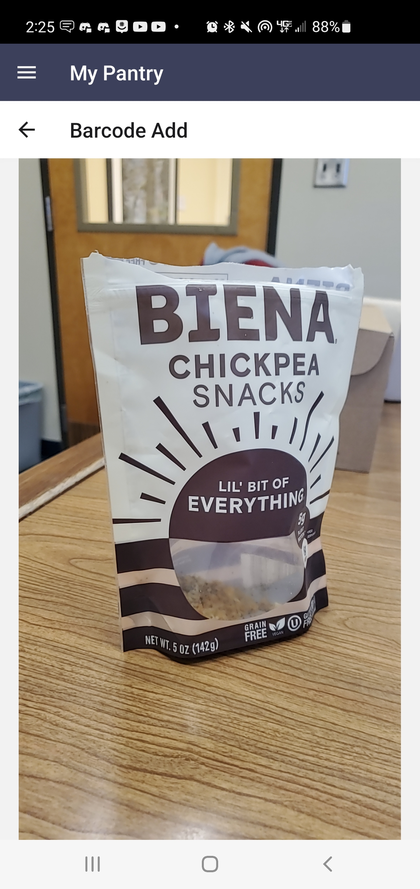</img>

### Update Item Page
This is a page the user may use to change some of the fields of an item in their pantry. Specifically, the user may change the name, weight, or quantity of an item they have selected. They may commit these changes by using the **Submit** button, or they may rollback the changes using the **Go back** button.

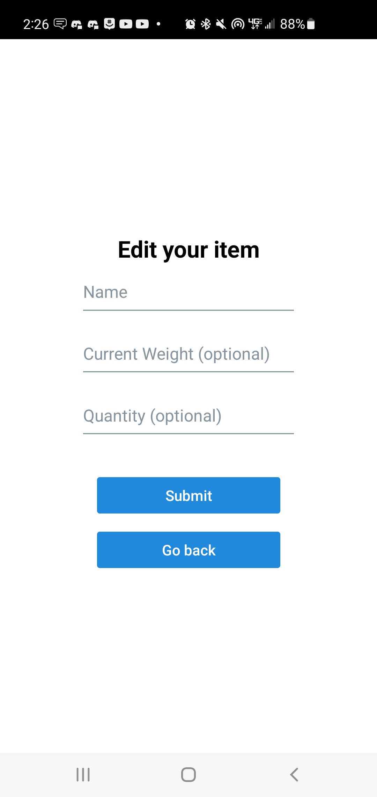</img>

### Delete Item Page
When the user attempts to delete an item, a pop-up will appear confirming whether the user would actually like to delete the item or not. If the user selects **YES**, the user will then be asked whether they would like to add the item to their shopping list (not pictured).

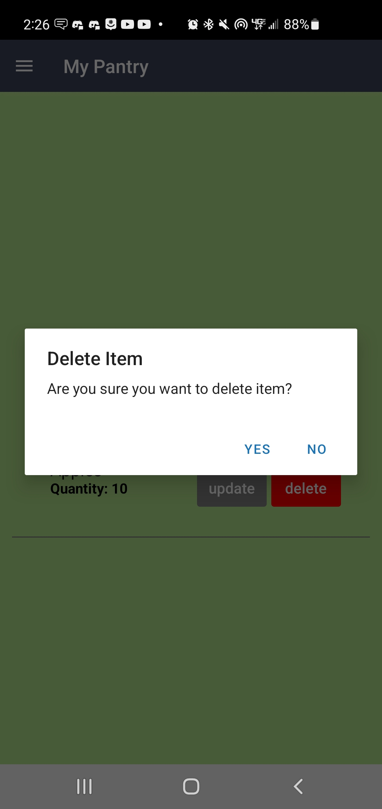</img>

### Shopping List Page
This page will display the name of all items in the user's shopping list, and will give the user the option to delete the items by selecting the **Delete Item** button. If the user selects this button, they will receive a pop-up identical to the **Delete Item Page**. The user may also select the **Add Item** button to add new items to their shopping list on the **Shopping List Add Page**. Note that this page will only display if the user has created a pantry.

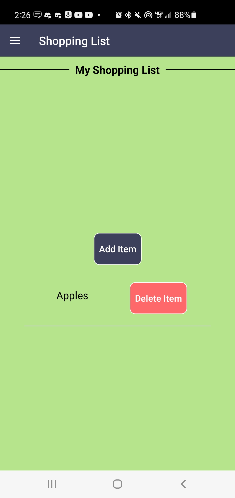</img>

### Shopping List Add Page
On this page the user will be able to add a new item to their shopping list by typing in a name for their item in the appropriate input field shown below. The user may then add that item to their list using the **Submit** button. The user may also return to the **Shopping List Page** using the arrow in the top left corner.

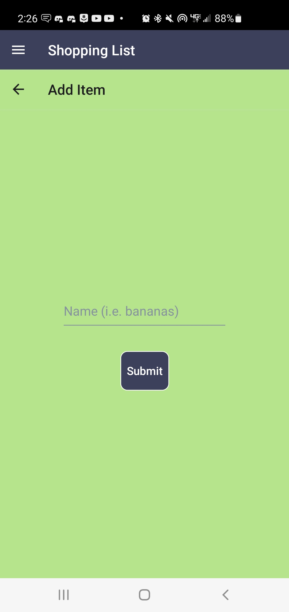</img>

### Profile Page
On this page, the user can view their profile, which displays their email address and their phone number as they input when they created their account.

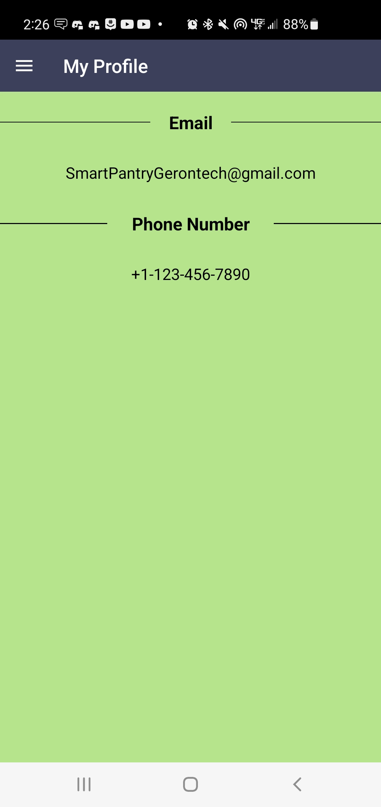</img>

### Help Page
This page will allow the user to learn about how to use their Smart Pantry app.

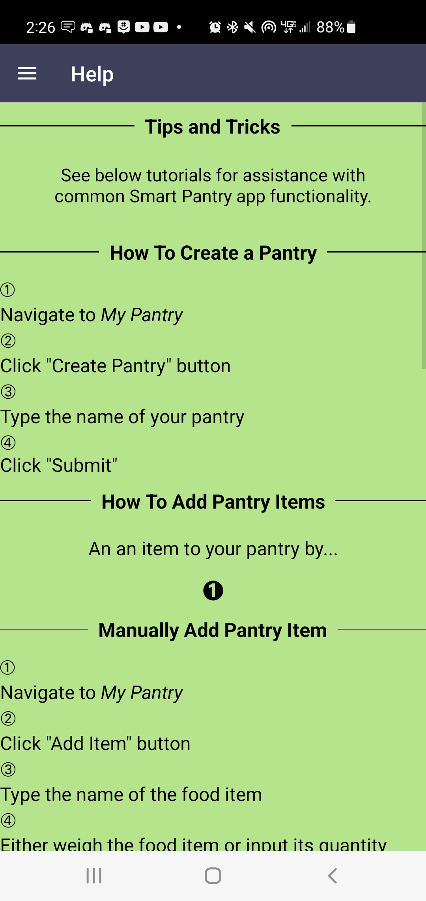</img>

### Settings Page
This page will allow the user to navigate to the various settings pages for the application. The user may visit the **Profile Page** by clicking the **My Information** button. The user may navigate to the **Manage Pantry Page** by selecting **Manage My Pantry**. The user can visit the **Collaborator Pantry Page** by selecting **Collaborator Pantry**. The user can visit the **Notifications Page** if they select **Notifications**. The user may select **Help** to visit the **Help Page**. The user can visit the **About Page** by selecting **About**. The user can visit the **Credits Page** by selecting **Meet The App Developers**. Finally, the user may access the **Sign Out Page** by selecting **Sign Out**.

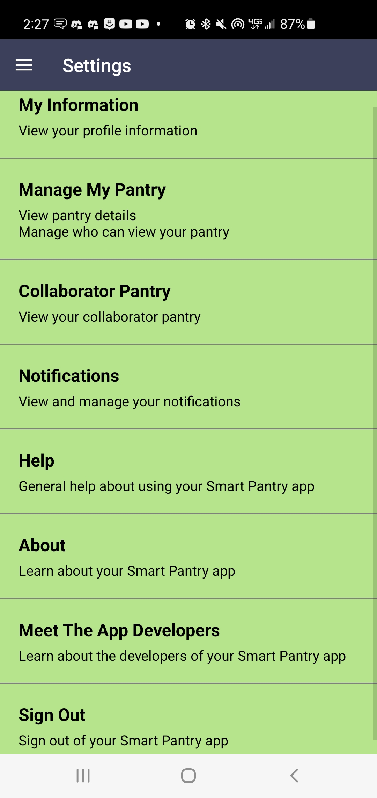</img>

### Manage Pantry Page
This page will allow the user to view information about their pantry and change some of its settings.

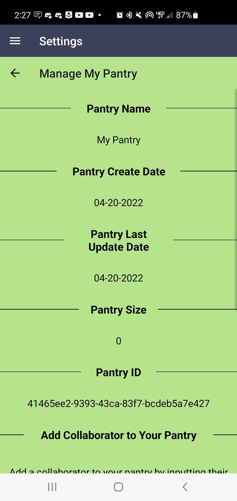</img>

In this page, the user may add a collaborator to their pantry by adding the user's email address appropriate input field. The user may also choose to delete their pantry by selecting the **Delete Pantry** button.

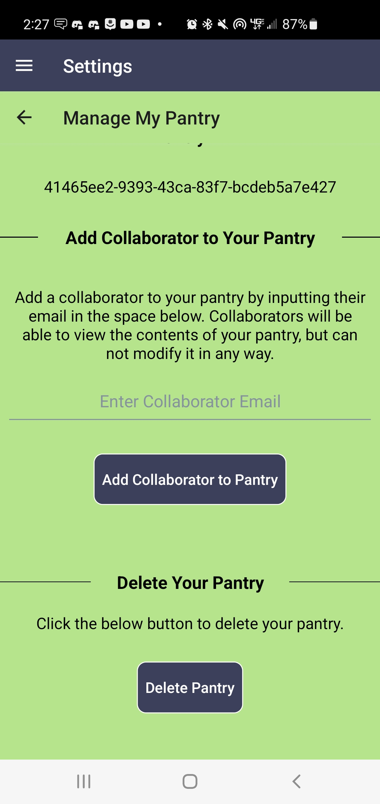</img>

### Collaborator Pantry Page
Here the user can view a pantry which they have been added to as a collaborator. They cannot make any modifications to the pantry, however they may choose to add an item to their shopping list using the **ADD TO SHOPPING LIST** button.

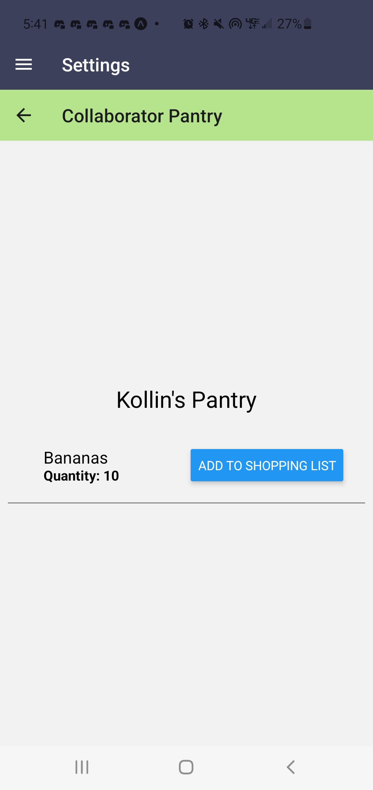</img>

### Notifications Page
This page will allow the user to change the frequency of notifications they will recieve. The user may select any of the buttons which shows their preferred frequency and it will update it for their pantry. The user may also test their notifications by selecting **CLICK HERE TO TEST NOTIFICATIONS**.

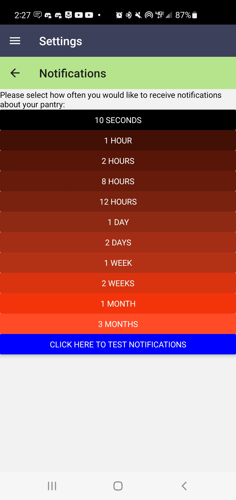</img>

### About Page
This page displays information about the Smart Pantry app to the user.

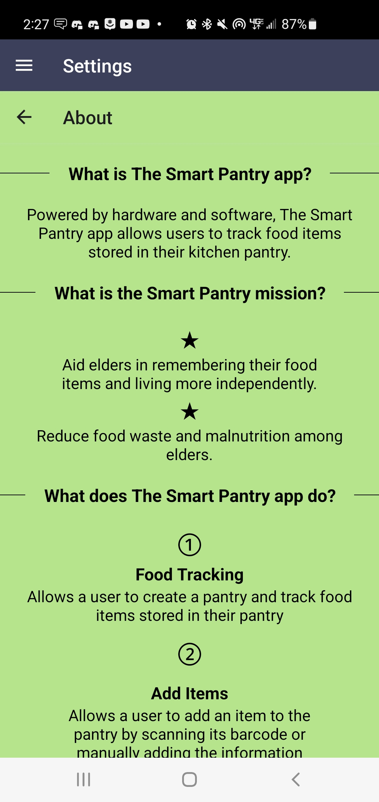</img>

### Credits Page
This page displays information about the creators of the application.

</img>

### Sign Out Page
This page features a pop-up to confirm whether the user would like to sign out of their account. If they select **YES**, they will be navigated to the **Sign In Page**.

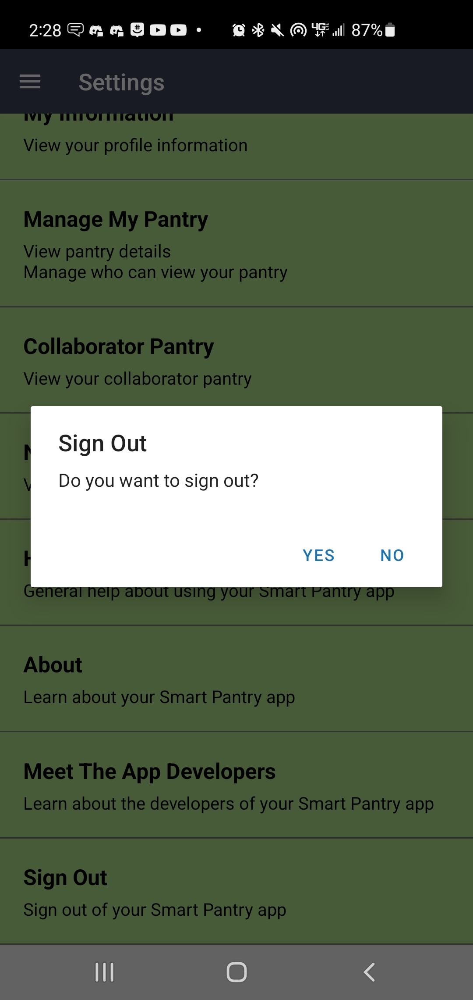</img>