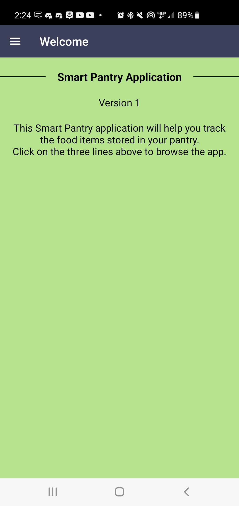
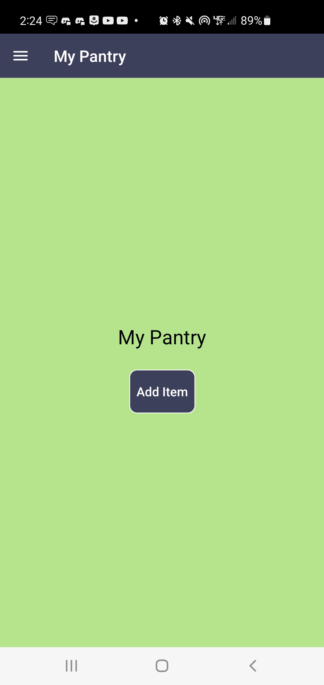
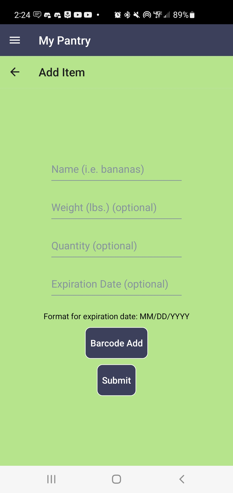
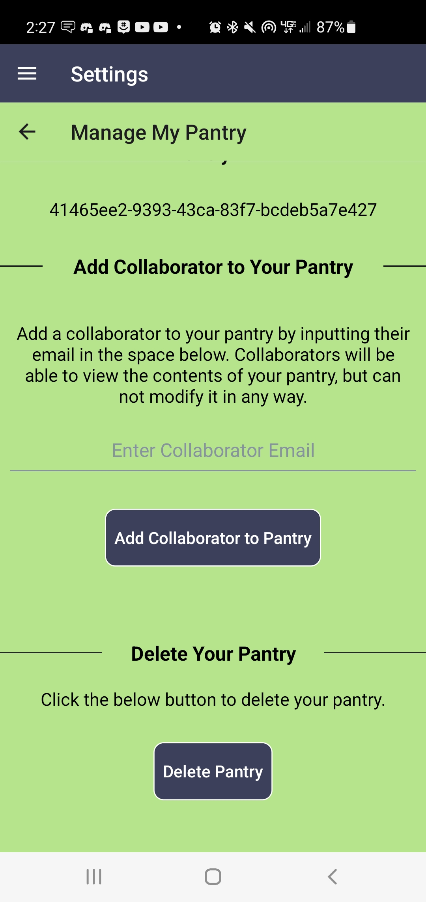
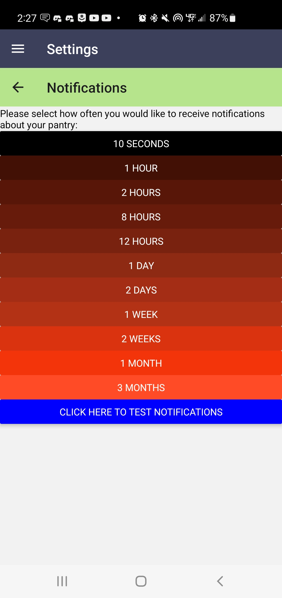
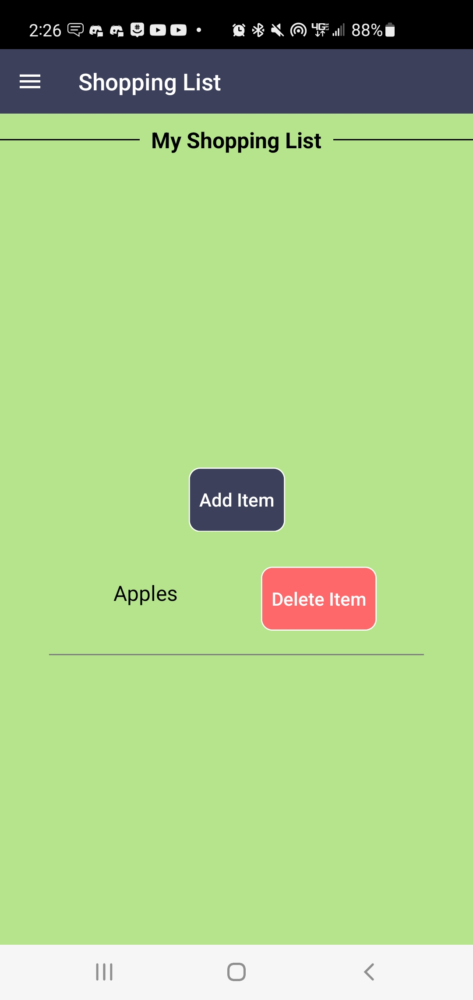
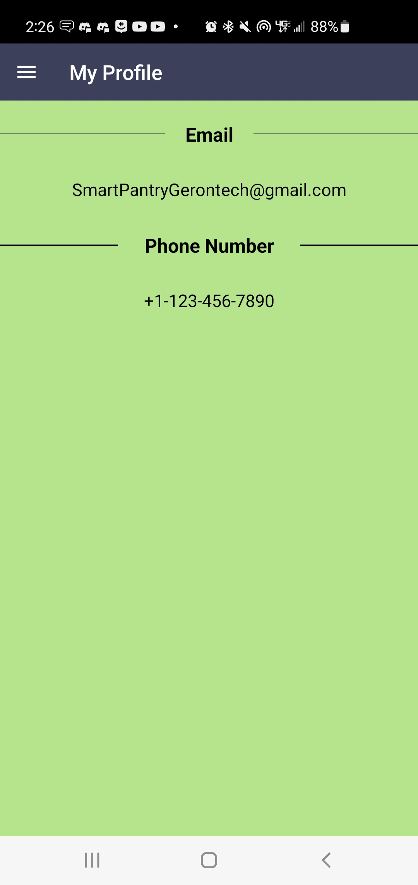
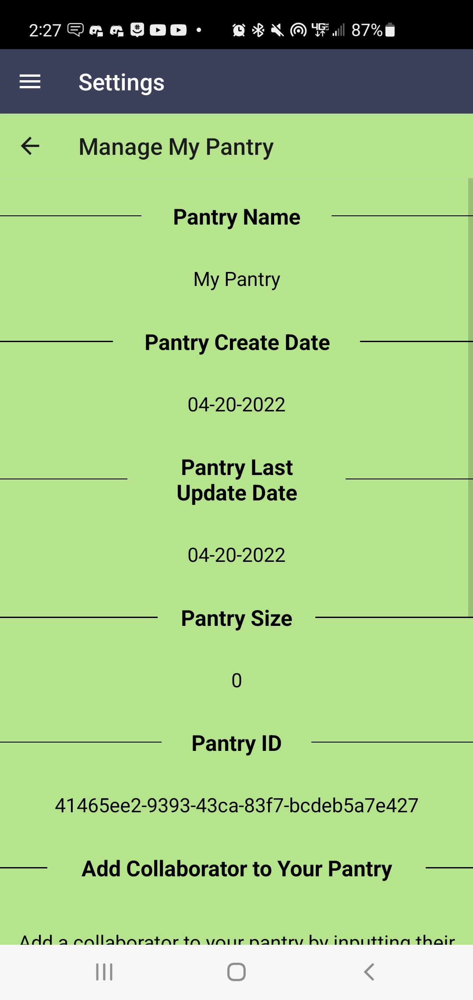
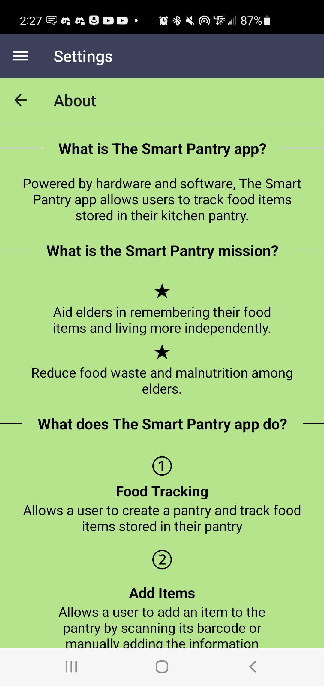

# User Manual
### Create Account
Creating an account is the first step you will want to take upon downloading your Smart Pantry app. Creating an account will allow you to access all of the Smart Pantry's features, including creating and accessing your pantry. Once you have downloaded the app, you should see a screen that looks like the below screenshot:

</img>

Notice the **Sign Up** button in the lower right of the screen (pictured above). Click this button to navigate to a new page that looks like the image below. On this screen, enter a username, password, email address, and a phone number. There are a few things to note here. First, the chosen username must be in the form of an email address (see example in the picture). It is recommended that you use the same email for your username and email address. For you password, we recommend using at least 12 characters, and a mixture of upper/lower case letters, numbers, and symbols (although this is not enforced). Ensure that the phone number you enter is a valid phone number (must be 10 characters long). When you are satisfied with the information you have entered, click the confirm button (pictured below).

</img>

Now that you have entered your new login information, you should receive a confirmation code at the email address you have specified. If you do not receive a confirmation code within about a minute, you can send another one by clicking **Resend code** in the bottom left of the screen. An example code is shown in the image below. You should enter your username again and enter your confirmation code, and click the **Confirm** button when you are done.

</img>

If you have followed all of the steps, your new account will be created and you will be redirected to the **Sign in** page.

### Login
Once you have created an account, you are ready to log in and start to explore your Smart Pantry. If you have not logged in yet, you should be greeted by a sign in page once you log in that looks like the image below. Simply enter the username and password you used when you created your account, and click the **SIGN IN** button.

</img>

If your login was successful, you should be directed to a page that looks like this:

</img>

If you login was unsuccessful, consider resetting your password by selecting the **Forgot Password** button in the lower left of the first image in this section. You will be directed to a page that looks like the image below, and you will be prompted to enter your email. Check your email afterwards for a message about resetting your password.

</img>

### Sign Out
If at any point while using the app you wish to sign out, you can first click the icon in the top left of the screen to bring up a drawer:

</img>

Once you have brought up the drawer, you can select the **Sign Out** option at the bottom:

</img>

A pop-up menu should appear asking for your confirmation. Selecting yes will sign you out of your account, returning you to the **Sign In** screen.

</img>

### Navigating the App
Navigating the app is done by using a drawer which is brought up by using an icon in the top left of the screen:

</img>

Selecting this icon will bring up several options as shown in the next image. More info on each of these options will be explored later in this manual.

</img>

### Create Pantry
When you first create an account, the first thing you will probably want to do is make a pantry. Making a pantry allows you to add items and keep track of them, but it also gives you access to other features, such as the **Shopping List** and **Notifications**. In order to create a pantry, first open up the drawer in the top left corner (see **Navigating the App**). Select the option which reads **My Pantry**:

</img>

This will bring you to a page that looks like the following image (if you haven't already created a pantry). Select the **Create Pantry** button to create your pantry.

</img>

Next, choose a name for your pantry an type it into the input field that appears. When you have selected a name you are satisfied with, click **Submit**.

</img>

If you see a page that looks like the following image, you have successfully created your pantry!

</img>

### Manual Add Item
To get the most use out of your pantry, you will want to be able to add items to it. There are 2 different ways to do this with your Smart Pantry app, the first of which is the **Manual Item Add**. To do this, make sure you are on the **My Pantry** tab, and click the **Add Item** button (it should appear below the name of your pantry).

</img>

Next, you will be redirected to the **Add Item** screen. Here, you can enter various information about the food item you are adding. You are required to enter a name for your item, but you may also optionally choose to add a weight (in pounds), a quantity, and/or an expiration date for you item. The 3 optional fields are used by the app to determine when you should receive notifications. When you are satisfied with the information you have entered for your item, click **Submit**.

</img>

You should be redirected to back to your **My Pantry** screen. Notice that the item you have added is now displayed under the name of your pantry, along with any additional information you have input for it.

</img>

### Barcode Add Item
An alternative method of adding an item to your database is known as the **Barcode Add** function. You can do this by navigating to your **My Pantry** screen and selecting the **Add Item** button, just as with the **Manual Add** method.

</img>

This time, instead of filling in any of the above fields, click **Barcode Add**.

</img>

This will open up your camera as shown below. Find the barcode on the food item you wish to add to your pantry, and scan it by pointing your camera at it so that the barcode is upright.

</img>

The barcode should scan automatically once it has been detected by the camera. In the event that the barcode is not recognized, you will be prompted to manually add (see previous section), however, if the scan was successful, you will be navigated to a new screen with the name of your item automatically populated:

</img>

You may optionally enter either a weight or a quantity. When you are satisfied with the options you have selected, click the **Submit** button to be sent back to the **Add Item** screen. From here simply click the back arrow in the top left corner to return to your **My Pantry** page and see your newly populated item.

</img>

### Update Item
When viewing the items in your database, you may notice the **update** button next to the information for each item. To update an item, simply click the **update** button which is located next to the specific item you would like to update. For this example, we will update the "Apples" item.

</img>

Clicking the **update** button for an item will bring up a screen where you can input new fields for your item. You may update the name, weight, or quantity of your item (fields left blank will stay the same). Notably, you cannot update the expiration date of your item, so if you make a mistake typing in your item's expiration date, you will have to delete the item and add it again (see the next section on deleting items). Here we change the "Apples" item to "Bananas" with a new quantity of 4.

</img>

When you are satisfied with the changes you have made, click **Submit**. This will return you to the **My Pantry** screen. Note that the item has been updated with the fields you have entered.

</img>

### Using the Scale
You can add an item using the Smart Pantry scale when manually adding an item, barcode adding an item, or updating an item. To do so, first place the item you wish to weigh on the scale, then click the "Use Scale" button. The weight from the scale will be automatically matched to the item you are attempting to add. NOTE: This should be the last action you take before submitting your created item.

### Delete Item
Next to the **update** button for each item in the pantry is a **delete** button. To delete an item from your pantry, click the **delete** button which is next to the item you would like to delete. In this example, we want to delete the "Bananas" item from our pantry.

</img>

When you click the **delete** button to an item, you will see the following pop-up message:

</img>

Answering **YES** to the question will remove the item from your pantry, but it will also pull up another pop-up as follows:

</img>

Answering **YES** to this question will add the deleted item to your shopping list, which is a feature of your Smart Pantry app which is discussed later in this manual.

### Delete Pantry
While working with your Smart Pantry app, you may decide that you would like to delete your entire pantry. **NOTE**: Before you do this, be aware that deleting your pantry will delete all items in your pantry, AND all items in your Shopping List. It is also important to note that you will not receive any notifications if you do not have a pantry. If you are okay with this consequences, open the drawer menu from the icon in the top left corner of the screen:

</img>

Click on the **Settings** button that appears in this drawer:

</img>

Next, click on the **Manage My Pantry** option in the Settings menu.

</img>

Now scroll to the bottom of this new page. It should look like the following picture:

</img>

Click the button labeled **Delete Pantry**, and you should receive a pop-up that looks the the picture below. Select **YES** to delete your pantry. You should receive a confirmation message saying that your pantry was deleted.

</img>

### Notifications
Notifications are one of the main features of your Smart Pantry, and they are designed to happen seamlessly. First of all, you must have a pantry before you can start to receive notifications (see the section about creating a pantry). Secondly, you will only get notifications in the event that at least one of your items is expiring soon (~ within 15 days) and/or one of your items is running low (the weight or the quantity of the item falls below 30% of its original weight/quantity at creation). A notification will output a summary of the amount of items expiring soon and the amount of items running low. Click on a notification to open up the Smart Pantry app, then check your **My Pantry** page for more information. An example of a notification received in a pantry with 1 item running low can be seen in this picture:

</img>

You can also change the frequency at which you receive notifications. The frequency is the minimum time between notifications being sent, so having a notification frequency of 1 day means that you will get a notification roughly once a day, depending on how often you open the Smart Pantry app. When you create a pantry, the default notification frequency is 1 day, however you can change this. To change your frequency, open the drawer for the app by clicking the logo in the top left of the app.

</img>

Click on the **Settings** option from this pop-out drawer menu. This will direct you to the **Settings** page:

</img>

From this page, select the **Notifications** option. This will take you to a screen that looks like this:

</img>

From here, click the button with the notification frequency you would like to switch to. Selecting an option will cause a pop-up to appear, confirming your decision. Additionally, if you would like to test push notifications, there is a button to do that on this page as well. Clicking that button will cause a notification to appear in a few moments as long as you have enabled notifications permissions for the application.

### Shopping List
The **Shopping List** is a feature intended to be used for keeping track of items the user would like to purchase the next time they visit the store. In practice, it acts as a simpler form of the pantry. To get to the shopping list, open the drawer menu by clicking the logo in the top left corner:

</img>

Select the **Shopping List** option from this menu. You should arrive at a screen that looks like the following:

</img>

From here, you can add an item to your shopping list by selecting the **Add Item** button. This will take you to a page that looks like the below image.

</img>

Here you can fill in the name of the item you would like to add to your shopping list. Click **Submit** after entering the name to add it to your list. You can continue to add as many items to your list as you would like. To return from this menu, click the back arrow in the top left. This will take you back to your **Shopping List**. Notice the **delete** option next to each item on your shopping list. Just as with the pantry (see the section of deleting items from a pantry), you can delete an item from your shopping list by selecting the **delete** button which is next to the item in the display. A pop-up will appear asking you to confirm whether you would like to delete you item. Select **YES** to delete the item from your list.

</img>

### Add Collaborators
A unique feature of the Smart Pantry app is the ability to allow other users to view your pantry. In order to add a collaborator to your account, first open the drawer using the logo in the top left corner:

</img>

Next, click on the **Settings** option from this menu.

</img>

In the **Settings** menu, select **Manage My Pantry** from the list of options. 

</img>

Once you have reached the **Manage Pantry** screen, scroll to the bottom of the screen. You should see something similar to the following image:

</img>

To add a collaborator to your pantry, type in the email address of the user you would like to add to your pantry in the space where it reads "Enter Collaborator Email". Note that this email does not necessarily need to belong to a currently existing account, however the user with the email you enter will need to create an account before they can see your pantry. Select **Add Collaborator to Pantry** to add the collaborator to your pantry. You will see a pop-up asking you to confirm your decision. Select **YES** to add the collaborator. You will also be asked whether you would like to email the user to notify them that you added them as a collaborator. If you respond with **YES**, your primary email app will open, and an email will be automatically generated, which you may choose to change, or just push send to send the email straight to whoever you wish to add as a collaborator.

### View Collaborator Pantries
If you have been added as a collaborator on another user's pantry, you can view their pantry by first opening the drawer by clicking on the logo in the top left corner of the screen:

</img>

Next, select the **Settings** option from the list in the drawer menu.

</img>

Then, select the **Collaborator Pantry** option from the **Settings** menu.

</img>

If you have not been added as a collaborator on another pantry, you will see a message notifying you of this. Otherwise, you will be able to see the contents of the user's pantry, as well as buttons which allow you to add items in the other user's pantry directly to your shopping list (see the section about shopping lists). Note that you cannot actually make any changes to the other user's pantry, only view their items and add items to your shopping list. (Selecting the **Add to Shopping List** button next to an item will cause a pop-up to confirm that you actually want to do that. Select **YES** to add the item to your list).

</img>

### Settings
The **Settings** section is where several different configuration options and other app information can be found. To get to this section, first open the drawer menu from the logo at the top left of the screen:

</img>

Next, click the **Settings** option that appears on the drawer:

</img>

You will then see the **Settings** screen. From here you can access several different pages of the app which perform different features.

</img>

The first of these features is the **My Information** page, which can alternatively be navigated to by selecting the **My Profile** option in the pop-up drawer. This page displays information about the user, including the email and phone number they used to create their account.

</img>

The next page in the **Settings** section is the **Manage My Pantry** section. This page displays information about the user's pantry, and is also where the user can add a collaborator to their pantry (see the section on adding collaborators), or delete their pantry (see the section on deleting a pantry). 

</img>

The next page is the **Collaborator Pantry** section. See the section on viewing collaborator pantries for more information.

</img>

The next page is the **Help** page. This page is used to explain how to perform various app functions in a step-by-step format.

</img>

The next page is the **About** page. This page displays information about the app, including its purpose and goals.

</img>

The next page is the **Meet the App Developers** page. This page shows the credits of the app, with information about each of its 5 developers.

</img>

Finally, there is a **Sign Out** option. See the section on signing out for more information.